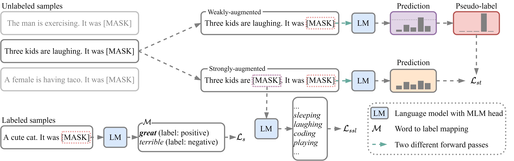

# SFLM

This is the implementation of the paper [Revisiting Self-Training for Few-Shot Learning of Language Model](https://arxiv.org/abs/2110.01256). SFLM is short for **s**elf-training for **f**ew-shot learning of **l**anguage **m**odel.


## Requirements
To run our code, please install all the dependency packages by using the following command:
```bash
pip install -r requirements.txt
```

## Preprocess
The original data can be found from [LM-BFF](https://nlp.cs.princeton.edu/projects/lm-bff/datasets.tar). To generate data for the few-shot experiments, please run the below command:
```bash
python tools/generate_data.py
```
The original data shall be in `./data/original`, and the sampled data will be in `./data/few-shot/$K-$MU-$SEED`. Please refer to `./tools/generate_data.py` for more options.

## Train
Our code can be run as the below example:
```bash
python3 run.py \
  --task_name SST-2 \
  --data_dir data/few-shot/SST-2/16-4-100 \
  --do_train \
  --do_eval \
  --do_predict \
  --evaluate_during_training \
  --model_name_or_path roberta-base \
  --few_shot_type prompt-demo \
  --num_k 16 \
  --max_seq_length 256 \
  --per_device_train_batch_size 2 \
  --per_device_eval_batch_size 16 \
  --gradient_accumulation_steps 4 \
  --learning_rate 1e-5 \
  --max_steps 1000 \
  --logging_steps 100 \
  --eval_steps 100 \
  --num_train_epochs 0 \
  --output_dir result/SST-2-16-4-100 \
  --save_logit_dir result/SST-2-16-4-100 \
  --seed 100 \
  --template "*cls**sent_0*_It_was*mask*.*sep+*" \
  --mapping "{'0':'terrible','1':'great'}" \
  --num_sample 16 \
  --threshold 0.95 \
  --lam1 0.5 \
  --lam2 0.1
```
Most arguments are the same as ```LM-BFF```, and the same manual prompts are used in our experiments. We list additional arguments used in SFLM:
* `threshold`: The threshold used to filter out low-confidence samples for self-training loss
* `lam1`: The weight of self-training loss
* `lam2`: The weight of self-supervised loss

## Citation
Please cite our paper if you use SFLM in your work:
```bibtex
@inproceedings{chen2021revisit,        
    title={Revisiting Self-Training for Few-Shot Learning of Language Model},         
    author={Chen, Yiming and Zhang, Yan and Zhang, Chen and Lee, Grandee and Cheng, Ran and Li, Haizhou},         
    booktitle={EMNLP},        
    year={2021},
}
```


## Acknowledgements
Code is implemented based on [LM-BFF](https://github.com/princeton-nlp/LM-BFF). We would like to thank the authors of [LM-BFF](https://arxiv.org/abs/2012.15723) for making their code public.